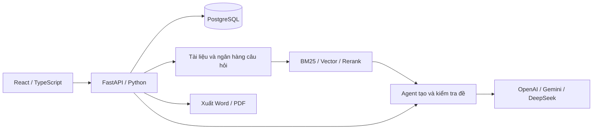

# Deka

Deka hỗ trợ giáo viên THCS xây dựng đề kiểm tra Khoa học tự nhiên từ nội dung
đã dạy, ma trận và bản đặc tả. Quy trình kết hợp tài liệu tham khảo, AI và bước
duyệt của giáo viên để hoàn thiện câu hỏi, đáp án và hướng dẫn chấm.

> Repository này là bản mockup công khai của Deka.

## Dự án gốc

Dự án gốc được xây dựng với các chức năng:

- **Soạn hồ sơ đề kiểm tra:** ma trận, bản đặc tả, câu hỏi, đáp án và rubric.
- **Bốn dạng câu hỏi:** trắc nghiệm, đúng/sai, trả lời ngắn và tự luận.
- **Duyệt và chỉnh sửa:** giáo viên duyệt từng câu, chỉnh nội dung và tạo lại
  câu hỏi theo phạm vi kiến thức đã chọn.
- **Tài liệu và RAG:** xử lý tài liệu PDF, Word, Excel và ảnh; truy xuất nội
  dung tham khảo để hỗ trợ tạo đề.
- **Ngân hàng câu hỏi:** lưu, tìm kiếm và tái sử dụng câu hỏi.
- **Xuất đề:** tạo bản Word/PDF kèm đáp án và hướng dẫn chấm.
- **Quản lý người dùng:** tài khoản, phân quyền, Google OAuth và MFA cho quản trị.

## Stack của dự án gốc

| Thành phần             | Công nghệ                                                        | Vai trò                                                       |
| ---------------------- | ---------------------------------------------------------------- | ------------------------------------------------------------- |
| Frontend               | React 19, TypeScript 5.7, Vite 6, React Router 8                 | Giao diện và điều hướng ứng dụng                              |
| Giao diện              | CSS, design tokens, KaTeX                                        | Bố cục, màu sắc và hiển thị công thức                         |
| Kết nối API            | Axios                                                            | Giao tiếp giữa frontend và backend                            |
| Backend                | Python 3.11–3.13, FastAPI, Uvicorn, Pydantic 2                   | REST API, kiểm tra dữ liệu và xử lý nghiệp vụ                 |
| Cơ sở dữ liệu          | PostgreSQL 16; SQLite cho môi trường local                       | Lưu tài khoản, đề, câu hỏi và metadata tài liệu               |
| ORM và migration       | SQLAlchemy 2, Alembic, psycopg2                                  | Truy cập dữ liệu và quản lý phiên bản schema                  |
| Xác thực               | PyJWT, bcrypt, Authlib, Google OAuth, TOTP                       | Đăng nhập, phân quyền và MFA                                  |
| AI                     | OpenAI Responses API, Google Gemini, DeepSeek                    | Sinh nội dung và kiểm tra câu hỏi                             |
| RAG                    | BM25, embeddings Gemini, Reciprocal Rank Fusion, reranker cục bộ | Tìm kiếm và kết hợp ngữ cảnh từ tài liệu                      |
| Vector store           | ChromaDB tùy chọn; cache trong bộ nhớ                            | Lưu và truy xuất vector khi bật embeddings                    |
| Đọc tài liệu           | pypdf, python-docx, openpyxl, pypdfium2, Pillow                  | Trích xuất nội dung PDF/DOCX/XLSX và xử lý ảnh                |
| OCR                    | Tesseract hoặc Gemini                                            | Nhận dạng nội dung trên ảnh và trang PDF cần OCR              |
| Xuất tài liệu          | python-docx, ReportLab; latex2mathml, mathml2omml                | Xuất Word/PDF và chuyển đổi công thức                         |
| Kiểm thử               | pytest, pytest-asyncio, Vitest, Testing Library, ESLint          | Kiểm tra backend, frontend và chất lượng mã                   |
| Đóng gói và triển khai | Docker, Docker Compose, Nginx, Caddy (xây bằng Go), ClamAV       | Chạy các dịch vụ, phục vụ frontend, HTTPS và quét tệp tải lên |
| Quản lý dependency     | uv, npm                                                          | Quản lý môi trường Python và JavaScript                       |

### AI và truy xuất tài liệu

Chuỗi provider sinh nội dung mặc định là **OpenAI → Gemini → DeepSeek**;
việc chọn provider và chuyển tiếp phụ thuộc cấu hình của từng tác vụ.
Các bước tạo ma trận, bản đặc tả, câu hỏi, đáp án và kiểm tra được tổ chức
thành các agent Python trong backend.

RAG hỗ trợ tìm kiếm BM25 và truy xuất vector bằng embeddings Gemini.
Kết quả được kết hợp bằng Reciprocal Rank Fusion, xếp hạng lại và giới hạn
ngân sách ngữ cảnh trước khi đưa vào tác vụ AI. ChromaDB là thành phần
**tùy chọn**; hệ thống có thể dùng cache vector trong bộ nhớ.

Tài liệu được ưu tiên trích xuất văn bản có sẵn. OCR bằng Tesseract hoặc
Gemini được dùng cho ảnh và các trang cần nhận dạng.

## Kiến trúc của dự án gốc


```mermaid
flowchart LR
    UI[React / TypeScript] --> API[FastAPI / Python]
    API --> DB[(PostgreSQL)]
    API --> DOC[Tài liệu và ngân hàng câu hỏi]
    DOC --> RAG[BM25 / Vector / Rerank]
    RAG --> AGENTS[Agent tạo và kiểm tra đề]
    API --> AGENTS
    AGENTS --> LLM[OpenAI / Gemini / DeepSeek]
    API --> EXPORT[Xuất Word / PDF]
```

## Chạy mockup

Yêu cầu **Node.js 24.x** và npm.

```bash
npm ci --prefix frontend
npm run dev
```

Kiểm tra và build:

```bash
npm run check
npm run audit
npm run build
```
