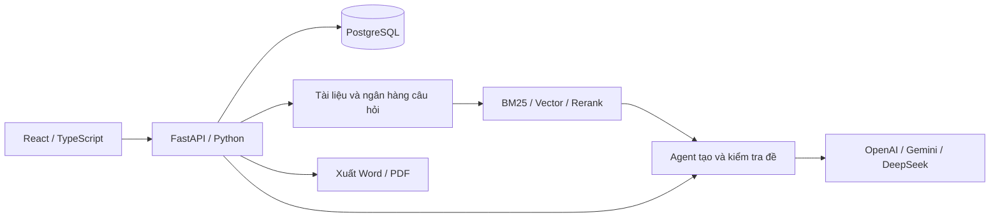

# Deka

Deka hỗ trợ giáo viên THCS xây dựng đề kiểm tra Khoa học tự nhiên từ nội dung
đã dạy, ma trận và bản đặc tả. Quy trình kết hợp tài liệu tham khảo, AI và bước
duyệt của giáo viên để hoàn thiện câu hỏi, đáp án và hướng dẫn chấm.

> Repository này là bản mockup công khai của Deka.

## Chức năng của dự án gốc

### 1. Không gian làm việc và tổng quan

- Xem số đề đã tạo, câu hỏi đã sinh, câu hỏi trong ngân hàng và tài liệu.
- Hiển thị thống kê theo phạm vi cá nhân, trường học hoặc toàn hệ thống,
  tương ứng với vai trò của tài khoản.
- Mở nhanh đề gần đây và truy cập các khu vực soạn đề, tài liệu, ngân hàng
  câu hỏi và cộng đồng.

### 2. Thiết lập đề và phạm vi kiến thức

- Soạn đề Khoa học tự nhiên cho lớp **6, 7, 8 và 9**.
- Nhập trường, năm học, loại kiểm tra giữa/cuối học kỳ, thời gian làm bài
  và số mã đề cần tạo.
- Chọn hoặc bổ sung chủ đề, số tiết và yêu cầu cần đạt; lấy gợi ý từ dữ liệu
  chương trình theo khối lớp và kỳ kiểm tra.
- Cấu hình số câu, điểm mỗi câu và các dạng câu hỏi được sử dụng.
- Điều chỉnh tỷ lệ **Nhận biết – Thông hiểu – Vận dụng**.
- Thiết lập số câu tính toán bắt buộc, điểm và mức độ của từng câu.
- Tự phân bổ điểm theo tỷ lệ mức độ hoặc nhập điểm thủ công; kiểm tra tổng
  điểm và bước chấm **0,25 điểm**.
- Tự lưu cấu hình đang nhập trên trình duyệt theo tài khoản và trường,
  khôi phục khi quay lại form.

### 3. Ma trận và bản đặc tả

- Tạo ma trận phân bố câu hỏi theo chủ đề, dạng câu, mức độ và điểm số.
- Xem tổng số câu, tổng điểm và tỷ lệ phân bố của đề.
- Tạo bản đặc tả gắn từng câu với nội dung kiến thức và yêu cầu cần đạt.
- Giữ liên hệ giữa cấu hình ban đầu, ma trận, đặc tả và câu hỏi khi tạo hoặc
  chỉnh sửa đề.
- Xem riêng ma trận hoặc bản đặc tả trong không gian làm việc.

### 4. Sinh câu hỏi, đáp án và hướng dẫn chấm

- Tạo bộ đề từ chương trình đã chọn và các tài liệu được phép sử dụng.
- Hỗ trợ bốn dạng câu hỏi:
  - **Trắc nghiệm:** các phương án, đáp án đúng và giải thích.
  - **Đúng/sai:** bốn nhận định với đáp án và giải thích cho từng nhận định.
  - **Trả lời ngắn:** đáp án mong đợi, bao gồm câu tính toán.
  - **Tự luận:** câu hỏi hoặc các ý nhỏ, đáp án gợi ý và rubric theo tiêu chí.
- Sinh lời giải, hướng dẫn chấm và phân bổ điểm cho các phần của câu hỏi.
- Theo dõi tiến độ tạo ma trận, đặc tả, câu hỏi, đáp án và kiểm định ngay
  trong giao diện.

### 5. Duyệt, chỉnh sửa và kiểm định câu hỏi

- Xem câu hỏi theo từng dạng; mở rộng phần đáp án, giải thích và thông tin
  cần thiết khi duyệt.
- Lưu trạng thái duyệt cho từng câu và chọn các câu cần tạo lại.
- Chỉnh nội dung, phương án, nhận định đúng/sai, đáp án, lời giải, ý tự luận
  và tiêu chí chấm; lưu hoặc huỷ bản chỉnh sửa.
- Tạo lại có chọn lọc các câu chưa phù hợp, giữ các câu còn lại trong đề.
- Kiểm tra cấu trúc, điểm số, phạm vi kiến thức và các yêu cầu của dạng câu.
- Kiểm tra kết quả tính toán bằng bộ giải theo công thức được hỗ trợ;
  đối chiếu đáp án và chất lượng nội dung bằng trợ lý kiểm định độc lập.
- Hiển thị vấn đề cần sửa, như đáp án không thống nhất, nội dung mơ hồ,
  lệch mức độ hoặc câu hỏi tương tự câu đã có.
- Giữ kết quả chưa đạt kiểm định ở trạng thái nháp; cho phép sửa hoặc tạo
  lại các câu lỗi trước khi xuất đề và lưu vào ngân hàng.
- Kiểm tra phiên bản khi lưu chỉnh sửa để tránh ghi đè một cập nhật khác.

### 6. Công thức, bảng, hình ảnh và đồ thị

- Hiển thị công thức toán bằng LaTeX/KaTeX trong câu hỏi, lời giải và bản xem trước.
- Bổ sung văn bản, công thức, bảng và ảnh PNG/JPEG vào nội dung câu hỏi.
- Dựng hình vẽ hoặc đồ thị cơ bản bằng đường thẳng, đường gấp khúc, hình tròn,
  hình chữ nhật và nhãn văn bản.
- Giữ nội dung này khi chỉnh sửa, lưu ngân hàng, chia sẻ câu hỏi, tạo mã đề
  và xuất Word/PDF.
- Chuyển công thức sang định dạng toán của Word hoặc ảnh khi cần.

### 7. Lịch sử và quản lý đề

- Lưu hồ sơ đề gồm cấu hình, ma trận, đặc tả, câu hỏi, đáp án, rubric và
  trạng thái duyệt.
- Xem lại đề đã lưu, tiếp tục chỉnh sửa hoặc xử lý đề nháp.
- Tìm kiếm, lọc và phân trang theo môn, khối lớp, loại kiểm tra; lọc người
  tạo trong phạm vi quản trị được phép.
- Hiển thị số thứ tự đề trong tài khoản người tạo.
- Nhân bản đề thành hồ sơ mới với trạng thái duyệt được đặt lại.
- Xoá đề trong phạm vi quyền sở hữu hoặc quản trị.

### 8. Mã đề, bản xem trước và xuất tài liệu

- Tạo **1–30 mã đề** từ đề gốc đã được kiểm định.
- Trộn thứ tự câu trắc nghiệm, phương án và các ý phù hợp; ánh xạ lại đáp án,
  giải thích và số thứ tự tương ứng.
- Chọn xem đề gốc hoặc từng mã đề; tải lại cùng mã đề với thứ tự ổn định.
- Chuyển giữa bản xem của giáo viên và bản đề dành cho học sinh; bản học sinh
  chỉ hiển thị nội dung làm bài và điểm số.
- Xuất riêng từng tài liệu ở định dạng **Word hoặc PDF**:
  - Đề kiểm tra.
  - Đáp án và hướng dẫn chấm.
  - Ma trận.
  - Bản đặc tả.
- Chọn mã đề và đối tượng xem khi xuất; giữ công thức, bảng, hình ảnh và
  cách đánh số của mã đề đã chọn.

### 9. Thư viện tài liệu và OCR

- Tải lên hoặc kéo thả **PDF, DOCX, XLSX, PNG và JPEG**, gắn khối lớp cho tài liệu.
- Trích xuất văn bản gốc, xử lý nội dung theo trang và giữ thông tin nguồn.
- Chọn chế độ đọc tự động, chỉ văn bản gốc hoặc yêu cầu OCR.
- Nhận dạng ảnh và các trang PDF cần OCR bằng Gemini hoặc Tesseract theo cấu hình.
- Xem nội dung đã trích xuất, trạng thái xử lý và cảnh báo đọc/OCR.
- Lọc thư viện theo khối lớp và phạm vi tài liệu được phép truy cập.
- Tải xuống hoặc xoá tài liệu theo quyền của tài khoản.

### 10. Chọn nguồn và truy xuất RAG

- Chọn tài liệu cá nhân hoặc tài liệu được chia sẻ làm nguồn khi soạn đề.
- Chia tài liệu thành các đoạn có thông tin trang, mục và nguồn tham khảo.
- Tìm đoạn liên quan bằng BM25; bổ sung truy xuất vector khi embeddings được bật.
- Kết hợp kết quả, xếp hạng lại, loại đoạn lặp và giới hạn lượng ngữ cảnh
  đưa vào tác vụ AI.
- Giữ thông tin nguồn để hỗ trợ kiểm tra câu hỏi và phạm vi kiến thức.
- Áp dụng quyền truy cập tài liệu trước khi sử dụng nội dung làm nguồn.

### 11. Chia sẻ tài liệu

- Quản lý tài liệu theo ba phạm vi: **Cá nhân**, **Trong trường** và
  **Toàn hệ thống**.
- Chủ sở hữu chủ động chia sẻ tài liệu trong trường hoặc gửi yêu cầu chia sẻ
  toàn hệ thống.
- Super Admin xem yêu cầu, duyệt, từ chối hoặc thu hồi chia sẻ toàn hệ thống.
- Chủ sở hữu thu hồi chia sẻ hoặc gửi duyệt lại tài liệu bị từ chối.
- Người nhận xem và chọn tài liệu làm nguồn soạn đề theo quyền được cấp;
  quyền chỉnh sửa và xoá vẫn thuộc chủ sở hữu hoặc quản trị viên có thẩm quyền.

### 12. Ngân hàng câu hỏi

- Thêm câu hỏi thủ công hoặc lưu các câu đã duyệt từ đề kiểm tra.
- Giữ nội dung, phương án, nhận định, đáp án, lời giải, rubric và nội dung
  công thức/hình ảnh của câu hỏi.
- Tìm kiếm và lọc theo môn, khối lớp, chủ đề, dạng câu và mức độ.
- Tìm câu có ý nghĩa tương tự bằng hạ tầng truy xuất ngữ nghĩa.
- Xem trước câu hỏi phù hợp, đưa vào trình chỉnh sửa của đề và kiểm tra lại
  với ma trận trước khi lưu.
- Phát hiện câu trùng hoàn toàn và cảnh báo câu tương tự khi sinh, chỉnh sửa
  hoặc lưu vào ngân hàng.
- Quản lý, xoá và ghi nhận lượt tái sử dụng câu hỏi theo phạm vi được phép.

### 13. Cộng đồng giáo viên

- Tạo chủ đề câu hỏi mới hoặc chủ động chia sẻ câu hỏi từ ngân hàng cá nhân.
- Tìm kiếm, lọc theo lớp, dạng câu, mức độ và phân trang chủ đề.
- Xem câu hỏi, mở đáp án/lời giải và trao đổi với các thành viên đã đăng nhập.
- Bình luận và trả lời một bình luận cụ thể.
- Lưu bản sao câu hỏi cộng đồng vào ngân hàng cá nhân khi có quyền ghi nội dung.
- Tác giả gỡ chủ đề hoặc bình luận của mình; Super Admin kiểm duyệt nội dung
  của các thành viên.
- Chia sẻ bản sao nội dung câu hỏi, giữ riêng tài liệu nguồn và metadata cá nhân.

### 14. Tài khoản và đăng nhập

- Đăng ký bằng email/mật khẩu, xác minh email và gửi lại email xác minh khi
  chức năng đăng ký được bật.
- Đăng nhập bằng mật khẩu hoặc Google/Facebook OAuth khi được cấu hình.
- Ghi nhớ đăng nhập, kiểm tra phiên và đăng xuất.
- Khôi phục mật khẩu qua email; đổi mật khẩu và tên hiển thị trong trang tài khoản.
- Xem email, vai trò, thông tin trường được gán và ngày tham gia.
- Bảo vệ tài khoản Super Admin bằng MFA/TOTP, mã khôi phục và bước xác thực
  tăng cường cho thao tác quản trị.

### 15. Phân quyền và quản trị trường học

| Vai trò          | Phạm vi sử dụng                                                                    |
| ---------------- | ---------------------------------------------------------------------------------- |
| **Super Admin**  | Quản trị toàn hệ thống, trường học, tài khoản, cấu hình AI, kiểm duyệt và báo cáo. |
| **School Admin** | Soạn đề, quản lý giáo viên, mua gói và xem báo cáo trong trường được gán.          |
| **Teacher**      | Soạn đề, quản lý nội dung cá nhân và sử dụng học liệu được chia sẻ.                |
| **Viewer**       | Xem học liệu được phép truy cập và tham gia cộng đồng.                             |

- Tạo và cập nhật thông tin trường: tên, địa chỉ và số điện thoại.
- Tạo tài khoản, quản lý tên, vai trò, trường và trạng thái hoạt động theo quyền.
- Khoá/mở khoá tài khoản, đặt mật khẩu tạm và xoá mềm tài khoản.
- Thêm giáo viên vào trường, gỡ giáo viên hoặc chuyển trường theo thẩm quyền.
- Xem nhật ký các thay đổi quản trị, lọc và phân trang lịch sử.
- Giới hạn dữ liệu và thao tác theo tài khoản, trường và vai trò.

### 16. Gói AI, credit và báo cáo sử dụng

- Xem gói **FREE/BASIC/PRO**, trạng thái tài khoản AI, số credit, hạn mức và
  thời hạn sử dụng.
- Xem lịch sử giao dịch credit và các yêu cầu AI của tài khoản.
- Báo cáo theo khoảng ngày: số yêu cầu, kết quả thành công/thất bại, credit
  đã dùng và hoạt động theo ngày.
- School Admin xem báo cáo của mình và giáo viên thuộc trường; Super Admin
  xem toàn hệ thống, lọc tài khoản và mở chi tiết báo cáo.
- Super Admin điều chỉnh gói, hạn mức, trạng thái và cộng/trừ credit;
  lưu lịch sử thay đổi.
- Super Admin xem thêm thông tin provider, token và chi phí ước tính.

### 17. Mua gói và thanh toán

- Mua mới, nâng cấp hoặc gia hạn BASIC/PRO qua **VNPay** khi thanh toán được bật.
- Chọn thời hạn **1, 6 hoặc 12 tháng**; xem báo giá, credit được cấp và thời
  hạn mới trước khi thanh toán.
- Áp dụng quy đổi hoặc ưu đãi gia hạn theo điều kiện của gói và credit còn lại.
- Theo dõi trạng thái đơn và lịch sử thanh toán.
- School Admin chọn nhiều giáo viên trong trường để mua cùng gói và thời hạn,
  xem báo giá từng người và lịch sử đơn trường.
- Kích hoạt quyền lợi sau khi backend xác nhận thanh toán từ VNPay.

### 18. Quản trị cấu hình AI

- Super Admin xem cấu hình có hiệu lực cho tạo đề, kiểm định, embeddings và
  kiểm tra kết nối.
- Theo dõi trạng thái cấu hình của OpenAI, Gemini và DeepSeek.
- Kiểm tra kết nối và xem provider/model thực sự trả lời.
- Thay đổi model khi môi trường cho phép; làm mới thông tin cấu hình đang áp dụng.
- Phân biệt cấu hình sinh nội dung với cấu hình trợ lý kiểm định.

## Stack của dự án gốc

| Thành phần             | Công nghệ                                                        | Vai trò                                                       |
| ---------------------- | ---------------------------------------------------------------- | ------------------------------------------------------------- |
| Frontend               | React 19, TypeScript 5.7, Vite 6, React Router 8                 | Giao diện và điều hướng ứng dụng                              |
| Giao diện              | CSS, design tokens, KaTeX                                        | Bố cục, màu sắc và hiển thị công thức                         |
| Kết nối API            | Axios                                                            | Giao tiếp giữa frontend và backend                            |
| Backend                | Python 3.11–3.13, FastAPI, Uvicorn, Pydantic 2                   | REST API, kiểm tra dữ liệu và xử lý nghiệp vụ                 |
| Cơ sở dữ liệu          | PostgreSQL 16; SQLite cho môi trường local                       | Lưu tài khoản, đề, câu hỏi và metadata tài liệu               |
| ORM và migration       | SQLAlchemy 2, Alembic, psycopg2                                  | Truy cập dữ liệu và quản lý phiên bản schema                  |
| Xác thực               | PyJWT, bcrypt, Authlib, Google OAuth, TOTP                       | Đăng nhập, phân quyền và MFA                                  |
| AI                     | OpenAI Responses API, Google Gemini, DeepSeek                    | Sinh nội dung và kiểm tra câu hỏi                             |
| RAG                    | BM25, embeddings Gemini, Reciprocal Rank Fusion, reranker cục bộ | Tìm kiếm và kết hợp ngữ cảnh từ tài liệu                      |
| Vector store           | ChromaDB tùy chọn; cache trong bộ nhớ                            | Lưu và truy xuất vector khi bật embeddings                    |
| Đọc tài liệu           | pypdf, python-docx, openpyxl, pypdfium2, Pillow                  | Trích xuất nội dung PDF/DOCX/XLSX và xử lý ảnh                |
| OCR                    | Tesseract hoặc Gemini                                            | Nhận dạng nội dung trên ảnh và trang PDF cần OCR              |
| Xuất tài liệu          | python-docx, ReportLab; latex2mathml, mathml2omml                | Xuất Word/PDF và chuyển đổi công thức                         |
| Kiểm thử               | pytest, pytest-asyncio, Vitest, Testing Library, ESLint          | Kiểm tra backend, frontend và chất lượng mã                   |
| Đóng gói và triển khai | Docker, Docker Compose, Nginx, Caddy (xây bằng Go), ClamAV       | Chạy các dịch vụ, phục vụ frontend, HTTPS và quét tệp tải lên |
| Quản lý dependency     | uv, npm                                                          | Quản lý môi trường Python và JavaScript                       |

### AI và truy xuất tài liệu

Luồng tạo đề tương tác mặc định dùng **OpenAI** để sinh nội dung.
Kiểm định độc lập sử dụng **DeepSeek và Gemini** theo chế độ cấu hình.
Các luồng cho phép dự phòng hỗ trợ thứ tự **OpenAI → Gemini → DeepSeek**.
Các bước tạo ma trận, bản đặc tả, câu hỏi, đáp án và kiểm tra được tổ chức
thành các agent Python trong backend.

RAG hỗ trợ tìm kiếm BM25 và truy xuất vector bằng embeddings Gemini.
Kết quả được kết hợp bằng Reciprocal Rank Fusion, xếp hạng lại và giới hạn
ngân sách ngữ cảnh trước khi đưa vào tác vụ AI. ChromaDB là thành phần
**tùy chọn**; hệ thống có thể dùng cache vector trong bộ nhớ.

Tài liệu được ưu tiên trích xuất văn bản có sẵn. OCR bằng Tesseract hoặc
Gemini được dùng cho ảnh và các trang cần nhận dạng.

## Kiến trúc của dự án gốc


```mermaid
flowchart LR
    UI[React / TypeScript] --> API[FastAPI / Python]
    API --> DB[(PostgreSQL)]
    API --> DOC[Tài liệu và ngân hàng câu hỏi]
    DOC --> RAG[BM25 / Vector / Rerank]
    RAG --> AGENTS[Agent tạo và kiểm tra đề]
    API --> AGENTS
    AGENTS --> LLM[OpenAI / Gemini / DeepSeek]
    API --> EXPORT[Xuất Word / PDF]
```

## Chạy mockup

Yêu cầu **Node.js 24.x** và npm.

```bash
npm ci --prefix frontend
npm run dev
```

Kiểm tra và build:

```bash
npm run check
npm run audit
npm run build
```
