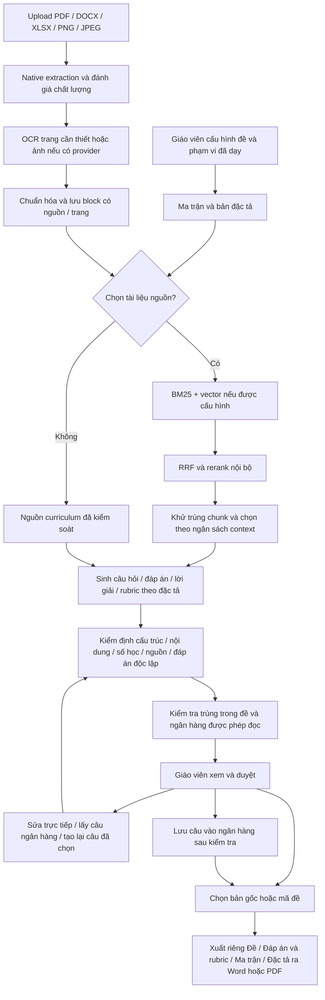

# User Flow — Deka

Cập nhật theo implementation US-168, ngày 09/09/2026. Phạm vi giữ nguyên
**Khoa học tự nhiên lớp 6–9** và curriculum/schema hiện có.

## Luồng tạo đề

Upload được xử lý và lưu trước; retrieval lập chỉ mục lười khi nguồn được truy
vấn. Không chọn tài liệu vẫn tạo đề bình thường. Câu tính toán bắt buộc giữ căn
cứ công thức trong registry theo khối; tài liệu tương tự không ghi đè căn cứ này.

## 1. Thiết lập phạm vi

- Giáo viên chọn trường, năm học, khối 6–9, loại kiểm tra, thời lượng, nội dung đã
  dạy, số câu/điểm theo dạng, tỉ lệ nhận biết–thông hiểu–vận dụng và số mã đề.
- Các yêu cầu tính toán, số bước chấm 0,25 điểm và đặc tả tri thức vẫn được giữ.
- Gợi ý curriculum không ghi đè nội dung giáo viên đã sửa. Form tự lưu trên trình
  duyệt theo tài khoản/trường; khôi phục form không tự chạy AI. Nguồn khôi phục
  phải được xác nhận còn quyền đọc trước khi tạo đề.
- Ma trận/specification quyết định dạng câu, mục tiêu, intent, reasoning và điểm;
  sửa câu không được đổi những thuộc tính này.

## 2. Tài liệu và RAG tùy chọn

Thư viện nhận PDF, DOCX, XLSX và ảnh PNG/JPEG, theo giới hạn upload hiện có.
PDF có text tốt dùng native extraction; trang scan/ít text/mã ký tự lỗi được OCR
nếu có Gemini hoặc Tesseract. DOCX/XLSX dùng native. Giáo viên có thể chọn chế độ
chỉ đọc text hoặc OCR lại PDF/ảnh có bố cục khó. Giới hạn trang/thời gian và lỗi
OCR được hiển thị theo trang; tài liệu hoàn toàn không đọc được bị từ chối.

Các khối text, heading, table, formula, caption giữ locator trang/phần. Retrieval
kết hợp BM25 và vector nếu có embedding, RRF, rerank và context budget. Vector
hoặc reranker ngoài không phải điều kiện bắt buộc; BM25 và rerank nội bộ hoạt động
độc lập. Không crawl web để tạo nội dung đề. Tài liệu vẫn dùng quyền cá nhân,
trong trường hoặc toàn hệ thống đã duyệt, không có quyền mới do vector cache.

## 3. Sinh và kiểm định

Câu hỏi, đáp án, lời giải và rubric được sinh trước khi giáo viên review. Các
cổng hiện có kiểm tra cấu trúc, mức độ, mục tiêu, scoring, công thức/số học, nguồn
và giải độc lập. Kết quả không được kiểm định đầy đủ vẫn lưu dưới dạng bản nháp,
không được xuất hoặc đưa vào ngân hàng.

Bộ chống trùng kiểm tra normalized exact, fuzzy và vector candidates trong đề
và toàn bộ ngân hàng thuộc phạm vi đọc. Cùng knowledge target chưa đủ coi là
trùng; khác dữ kiện số được giữ như bài khác. Kết quả có loại trùng, mức tương tự,
định danh câu đối chiếu, phạm vi và lý do. Semantic/fuzzy là cảnh báo cho giáo viên;
exact repeat bị chặn khi lưu vào ngân hàng. Không gọi LLM từng dòng ngân hàng.

## 4. Review, chỉnh sửa và tái sử dụng

Trên CreateExam hoặc bản gốc của đề đã lưu, mỗi QuestionCard có:

- Xem/thu gọn, duyệt hoặc đánh dấu cần sửa/từ chối, chọn để regenerate.
- Chỉnh sửa → form → Lưu và kiểm định / Hủy. MCQ sửa stem, A–D, đáp án, giải thích;
  đúng/sai sửa context và từng phát biểu/truth/lời giải; trả lời ngắn sửa đáp án;
  tự luận sửa câu, đáp án mẫu, các ý và rubric/thang điểm.
- Thêm LaTeX, bảng, ảnh nhúng hoặc hình vẽ có cấu trúc, xem trong preview.
- Lấy nội dung từ ngân hàng: tìm tương tự, chọn cùng dạng/mức độ, nhận edit template
  tương thích khối/điểm rồi chỉnh tiếp. Chỉ Save mới ghi dữ liệu/tăng usage.

Save giữ nguyên định danh, đặc tả, nguồn và generation metadata; thêm revision,
teacher_edited và edited_at. API kiểm tra version trước/sau kiểm định; thay đổi
đồng thời trả 409 và giữ form để thử lại. Cancel bỏ sửa cục bộ. Save không reload
mất session. Sửa số liệu phải qua bộ giải số học hiện có và kiểm định độc lập;
không đạt thì giữ bản nháp. Sửa ảnh có cảnh báo đối chiếu pixel vì reviewer văn
bản chỉ đọc chú thích. Câu sau sửa quay lại trạng thái chờ duyệt/cần sửa.

Tái tạo chỉ chạy các câu được chọn theo đặc tả cũ. Lỗi giữ nguyên lựa chọn và
nội dung hiện có, không báo thành công. Khi chuyển sang đề khác, phản hồi cũ
không được thay nội dung route mới.

## 5. Ngân hàng và cộng đồng

Câu lưu từ đề giữ đủ đáp án/rubric, rich content và metadata. Ngân hàng hỗ trợ
lọc thường hoặc tìm ý nghĩa tương tự bằng retrieval dùng chung. Các bản ghi cũ
có answer/rubric lồng vẫn đọc được. Dữ liệu nguồn/generation riêng tư không đi vào
snapshot công khai khi chia sẻ cộng đồng; rich blocks đã kiểm tra có thể đi theo.

## 6. Mã đề và export

Các mã được tạo tất định từ đề/id/mã: đảo vị trí MCQ, đảo options và remap đáp án,
giải thích theo options; TF đảo statement cùng truth và giải thích. Options cũ
tham chiếu vị trí A/B/C/D giữ thứ tự để tránh đổi nghĩa. Tự luận giữ yêu cầu khoa
học; số câu, rubric và đặc tả theo đúng bản gốc/mã được chọn.

Teacher preview xem lời giải, rubric, nguồn và phản hồi; student preview chỉ có
nội dung đề, options/statements/subquestions, rich content và điểm. Đây là chế
độ xem trong workspace giáo viên, không phải hệ thống thi online cho học sinh.

Export chọn **một** tài liệu: đề, đáp án/rubric, ma trận hoặc đặc tả; chọn bản gốc
hoặc một mã. Word xuất công thức OMML (fallback ảnh), bảng/ảnh/diagram nhúng. PDF
render công thức và hình trực tiếp bằng ReportLab. Không tải ảnh từ URL tùy ý,
không xuất raw LaTeX nếu cú pháp không render được. Bản nháp chưa kiểm định bị chặn.

Chi tiết API, config, giới hạn: [Authoring capabilities](product/authoring-capabilities.md).
Quyền: [Permissions](product/permissions.md), [Document sharing](product/document-sharing.md).
