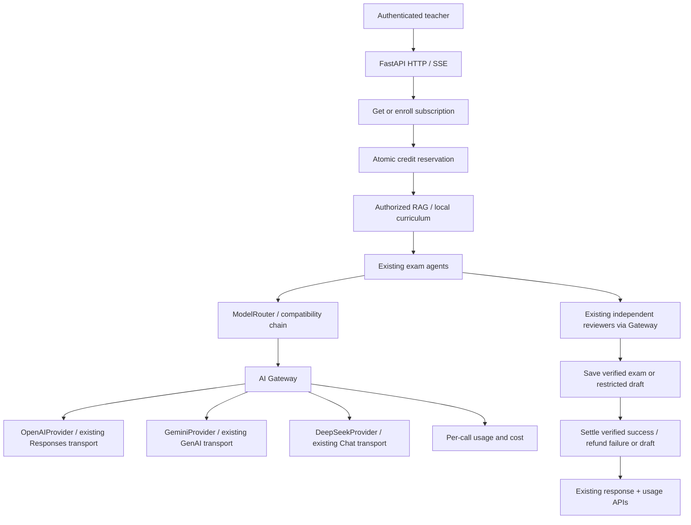

# AI architecture — development foundation

## Current architecture (audit)

- Frontend: React 19, TypeScript, Vite, Axios, React Router. Login/account and
  full-exam creation already exist, including SSE progress.
- Backend: FastAPI/Pydantic, synchronous SQLAlchemy 2 sessions around short DB
  operations, asyncio orchestration and `asyncio.to_thread` for SDK calls.
- Database: PostgreSQL supported; explicit local development selection uses
  SQLite when `USE_POSTGRES=false`. No fallback after a failed production DB
  connection. Existing tables use `create_all` plus compatibility columns;
  the new AI tables use versioned Alembic migrations.
- Authentication: existing JWT bearer tokens, bcrypt password hashes, Google/
  Facebook OAuth, persisted `users`, token-version revocation and role policy.
- Exam pipeline: curriculum/resources → matrix → specification → local/uploaded
  grounding → batched question/answer/rubric generation → validation and independent
  review/targeted repair → persisted verified exam or restricted draft → variants.
- RAG: local curriculum JSON plus authorized uploaded documents; chunk extraction,
  BM25/vector hybrid retrieval, fusion, reranking, context budget. Gemini embeddings;
  optional Chroma HTTP/embedded cache, bounded in-memory vector cache otherwise.
- Storage: `uploaded_documents` owns metadata/extracted text; original uploads in
  `UPLOAD_DIR`. Chunks are derived in memory, vectors cached by model/content.
- Providers: OpenAI Responses API, Gemini `google-genai`, DeepSeek through the OpenAI
  compatible Chat Completions SDK. Existing transport timeouts/retries are retained.
- Logging: Python logging, HTTP timing and provider telemetry. Gateway adds safe
  normalized errors and durable account attribution without prompt/key/body logs.

Kept: frontend/auth, SDK transports, RAG algorithms, output schemas, generation/
review gates and default model names. Refactored: provider invocation now passes
through Gateway adapters; the provider chain remains a compatibility facade.
Added: router/registry, accounting services, self APIs, development CLI and migration.

## Flow and modules



`app/services/ai/gateway.py` defines `AIResponse`: content, provider, model,
`TokenUsage(input_tokens, output_tokens, cached_tokens)`, latency_ms and optional
upstream request_id. The request summary's UUID is a separate application ID.
No missing usage field crashes generation. Provider transports keep SDK-specific
request/parse behavior; adapters normalize failures after response validation.
`ai_provider_chain.py` preserves legacy `.generate_json/.generate_text` APIs.
Mandatory reviewers also call the Gateway and stay explicitly pinned.

## Routing and configuration

All provider keys stay in backend environment variables:

```dotenv
OPENAI_API_KEY=
GEMINI_API_KEY=
DEEPSEEK_API_KEY=
AI_DEFAULT_PROVIDER=
AI_MODEL_FAST=
AI_MODEL_BALANCED=
AI_MODEL_PREMIUM=
ENABLE_CREDIT_SYSTEM=true
AI_MODEL_PRICING={}
```

The existing `OPENAI_MODEL`, `OPENAI_PRIMARY_ONLY_MODEL`, `OPENAI_VERIFY_MODEL`,
`GEMINI_MODEL`, `GEMINI_VERIFY_MODEL`, `DEEPSEEK_MODEL`, `DEEPSEEK_VERIFY_MODEL`,
`RAG_EMBEDDING_MODEL` and transport settings continue to apply. No default model
was replaced. New settings are read by backend only; never add keys to `VITE_*`.

A tier accepts `model-name` (uses default provider) or `provider:model-name`.
For example set `AI_MODEL_BALANCED=deepseek:deepseek-chat` to select that generation
route after backend restart. Blank overrides retain the existing primary-only
OpenAI model for interactive generation and existing fallback order for legacy
clients. Explicit overrides select the configured provider first; when the request
has `allow_provider_fallback=false`, no other generation provider is attempted.
Independent review retains its configured required Gemini/DeepSeek set, even if
the generation provider is changed. Review failures still block verified output.

Rules: normal generation → balanced; regeneration/answers/RAG text tasks → fast;
review → premium. The embedding registry entry references the existing Gemini
embedding setting. Embedding vectors retain their existing dedicated interface;
their SDK calls are metered within an active exam operation as `rag_query`.
`user_plan` is accepted by the router for future entitlements; current plans only
change allowance. No premium paywall or automatic quality downgrade is invented.

## Usage and cost

`ai_usage` has all requested accounting fields plus `record_kind`,
`provider_request_id`, `reserved_credits` and `error_code`.

- `record_kind=request`: one application operation, UUID `id=request_id`, total
  known tokens/cost, wall time, status, and the only nonzero `credits_charged`.
- `record_kind=provider`: each adapter attempt, including retries/fallbacks and
  reviewers, grouped by request_id. Contains actual provider/model and upstream ID
  when available. Multiple providers/models show `multiple` on the summary.
- Status: request `reserved`, `success`, `failed`; provider `success`, `failed`,
  `late_success`, `late_failed`. Late SDK results update measured cost without
  changing a refunded request's status or charging again.
- Do not sum summaries together with their provider rows: that double-counts usage.
- Unknown token counts or model prices are `null`. A summary is unknown when any
  attempt is unknown. Zero means a measured zero or an explicitly configured zero.
- SDK-internal retries are opaque: one adapter attempt can contain SDK retries;
  only usage the SDK actually returns is measurable. This is estimated accounting,
  not reconciliation against provider invoices.

`AICostCalculator` reads one JSON settings map, keyed `provider:model`, with USD
prices per million tokens: `input`, `output`, optional `cached_input`. It uses
Decimal and SQL Numeric, never floating-point credit arithmetic. Cached input is
subtracted from total input before applying its rate. Missing cached pricing uses
ordinary input pricing. Gemini output includes reported thinking tokens.

`AI_MODEL_PRICING={"openai:your-model":{"input":"2","output":"8","cached_input":"1"}}`
is a **shape example with fictional rates**, not current provider pricing. Populate
it manually for the models actually configured. Empty config intentionally gives
unknown cost. No pricing sync service is introduced.

## Credit and subscriptions

`user_subscriptions`: unique user_id, string plan/status, integer allowance and
balance, current-period bounds and timestamps. `credit_transactions`: immutable
signed integer amounts with unique `(user_id, type, reference_id)`.

Development defaults in `services/ai/pricing.py`:

| Plan | Monthly credits |
| --- | ---: |
| FREE | 50 |
| BASIC | 500 |
| PRO | 1500 |

| Operation | Credits |
| --- | ---: |
| exam_generation / question_generation | 10 |
| question_regeneration | 1 |
| answer_generation | 2 |
| exam_review | 5 (reserved for later standalone AI review billing) |

Enrollment is lazy on first account read/operation, covering existing and new
users without altering auth. Initial FREE credit is granted once. Active expired
subscriptions receive one allowance on next access, opening a new calendar-month
period. Missed months are not backpaid; unused credits carry over in development.
Plan changes update future allowance and do not immediately mint credits.
Additional plans can be added to config without a DB enum migration.

Reserve commits a conditional balance decrement and a negative ledger row before
RAG/AI. Sufficient balance and active subscription are required. No database
transaction remains open during network calls. Finalization claims a `reserved`
request with a conditional UPDATE; only one finalizer can settle or refund.
Success charges the configured flat operation cost once, regardless of retries.
Failed requests and unverified drafts refund it, even when the provider incurred
real cost. Successful offline/demo output with no provider calls is uncharged.
`ENABLE_CREDIT_SYSTEM=false` keeps usage/subscription tracking with zero reservation.

Main full-exam HTTP/SSE, both regeneration aliases, question-generation and
answer-generation endpoints are integrated. Other standalone matrix/specification,
AI debug, OCR upload and question-edit calls are not yet billed or attributed by
this operation boundary. Full-exam calls through those agents are covered.
Manual teacher review is not an AI review charge.

## API and development tools

Existing JWT authentication protects:

- `GET /api/me/subscription` — plan, allowance, balance and period.
- `GET /api/me/credits?limit=20&offset=0` — balance and ledger entries.
- `GET /api/me/usage?kind=request&limit=20&offset=0` — operation summaries.
- `GET /api/me/usage?kind=provider&request_id=<uuid>` — own provider attempts.

Queries always constrain user_id, including when a request_id is supplied.
Global provider settings remain super-admin only. These self usage projections
intentionally expose the user's own provider/model metadata per ADR-0047.

HTTP insufficient balance returns 402 with `detail.code=INSUFFICIENT_CREDITS`.
Gateway errors use AI_RATE_LIMITED, AI_TIMEOUT, AI_AUTH_ERROR, AI_PROVIDER_ERROR,
AI_INVALID_RESPONSE. Legacy chain detail strings are preserved; the normalized
code is also available in `X-AI-Error-Code`. After SSE headers, errors are events.
SSE reservation begins when iteration starts, before RAG. Result/error finalizes
before delivery; cancellation closes the upstream iterator and refunds.

CLI instead of public development mutation endpoints (run from `backend/`):

```bash
uv run python -m app.services.ai.dev show --user-id 1
uv run python -m app.services.ai.dev plan --user-id 1 --plan BASIC
uv run python -m app.services.ai.dev grant --user-id 1 --amount 100
uv run python -m app.services.ai.dev grant --user-id 1 --amount -10
uv run python -m app.services.ai.dev reset --user-id 1 --amount 500
uv run python -m app.services.ai.dev usage --user-id 1
```

The CLI refuses non-development/test ENV. The existing Docker Compose profile sets
`ENV=production`; for a development instance only, invoke the CLI with an explicit
`ENV=development` and `USE_POSTGRES=true` using that same database configuration.
Do not change the running container environment merely to access the CLI. Reset appends a balancing delta, never
erases ledger, and refuses while a request is reserved. There is no payment API,
webhook, invoice, frontend key, Redis, queue, or new admin UI.

## Failure recovery and limits

Python cancellation refunds immediately, though an already-started SDK thread
may finish later. Its late usage remains visible with zero additional credits.
A process crash or unavailable database cannot execute a refund at that moment.
The committed `reserved` row is the recovery record. After stopping the affected
worker, refund that exact request with this idempotent development command:

```bash
uv run python -m app.services.ai.dev recover --user-id 1 --request-id <uuid>
```

Do not recover requests still running. Automatic reconciliation/leases and
production migration orchestration remain future work. Usage storage failure
fails closed; provider fallback must not conceal an accounting DB failure.

## RAG isolation audit

`DocumentService.get_documents_for_rag` resolves current SQL permissions before
chunks/cache reads and rejects requested inaccessible IDs. Ranking operates only
on these authorized chunks; Chroma is an ID-addressed vector cache, not a global
nearest-neighbor query. Uploaded chunk metadata now includes `user_id`; vector
keys include owner, document/chunk and content hash. Chroma metadata records owner.
Cached vectors from the old key format are ignored and lazily re-embedded.

Private teacher A content is unavailable to teacher B. Existing deliberate
exceptions remain: owner-granted school sharing, super-admin-approved system
sharing, school-admin oversight within their school and super-admin oversight.
Shared curriculum is public application data. Ownerless legacy records are not
visible to ordinary teachers. Internal `actor=None` document access remains a
maintenance privilege: new HTTP retrieval routes must always pass an actor.
Changing to global vector search later will require equivalent tenant/permission
filters; cache metadata alone does not grant authorization.

## Migrations and testing

The existing bootstrap initializes legacy tables, then executes Alembic revisions
`0001_ai_accounts` and `0002_sqlite_account_cleanup` on the **same selected engine**. It creates only the three new
tables and indexes; no old rows are updated or deleted. The second revision adds
a SQLite-only delete trigger for the new accounting tables, preserving cascade
semantics even on legacy connections that do not enable foreign keys. Existing users enroll
lazily. Startup no longer publishes a session factory until migration succeeds.
Docker includes Alembic assets. No database URL or credentials are in alembic.ini.

For an existing application database, from backend: `uv run alembic upgrade head`.
A fresh database is initialized by the existing application startup. Downgrade is
explicitly destructive to the new accounting tables and is not part of setup.
Alembic owns only the new tables; this change does not pretend to version every
historical compatibility migration.

```bash
uv run pytest tests/test_ai_gateway.py tests/test_ai_credits.py tests/test_ai_operations.py tests/test_ai_account_api.py tests/test_ai_account_migration.py tests/test_ai_rag_isolation.py -q
uv run pytest tests/ -q
```

Tests use mocked providers and isolated DB fixtures for new accounting cases.
No paid SDK calls are needed. See [validation evidence](validation/ai-foundation.md)
for actual runs and remaining live-provider proof gaps. Optional PostgreSQL proof
uses a temporary schema: `AI_TEST_POSTGRES=1 uv run pytest tests/test_ai_postgres.py -q`.
Supply a working `DATABASE_URL`; `AI_TEST_POSTGRES_HOST` can override a Docker-only
hostname when running from the host. It never modifies public application tables.

Migration implementation follows the [Alembic shared-connection recipe](https://alembic.sqlalchemy.org/en/latest/cookbook.html#sharing-a-connection-across-one-or-more-programmatic-migration-commands)
and conditional balance updates use [SQLAlchemy UPDATE](https://docs.sqlalchemy.org/en/20/tutorial/data_update.html).

## Account UI

The `/account` screen includes “Gói sử dụng & credit”: current plan/period,
available credits, and the ten most recent AI operations or ledger changes.
It uses the same paper/olive light/dark theme and reads the authenticated self APIs.
The refresh button retrieves the latest changes after an operator adjusts a plan
or balance. No frontend payment or plan mutation was added.

## Subscription catalog and usage reports

The landing page presents FREE / BASIC / PRO through public
`GET /api/subscription-plans`, using the same `PLAN_ALLOWANCES` as enrollment.
Current development defaults are 50 / 500 / 1500 credits per month. There is no
payment or self-service upgrade; an operator assigns the plan. A custom account
allowance may differ from the public default.

Open **Thống kê sử dụng** (`/#/usage`) from workspace navigation:

| Role | Report scope | Edit subscription |
| --- | --- | --- |
| Teacher / Viewer | Own account | No |
| School Admin | Self and teachers in assigned school | No |
| Super Admin | All nondeleted accounts; filter role/name/email and dates | Yes |

`GET /api/usage/report` accepts `date_from`, `date_to`, `role`, `search`,
`user_id`, `limit` (1–100) and `offset`. The default is the last 30 UTC calendar
days; inclusive ranges are limited to 366 days. Summaries, daily activity and
role aggregates cover the entire filtered scope, independent of the user page.
`GET /api/usage/users/{id}` returns the authorized account, subscription,
aggregate metrics and paginated request history for the date range. A target
outside the caller's scope returns 404. Report reads do not create accounts or
issue renewal credits. Balances are current stored balances; lazy renewal still
occurs on self-account access or an AI request.

Request rows count operations, success/failure/pending and charged/reserved
credits. Provider rows count actual attempts, tokens and estimated cost, so
request summaries never double-count provider cost. `known_cost_usd` reports
only priced attempts; `estimated_cost_usd` is null when any attempt is unpriced.
`unpriced_calls` and `unknown_token_calls` identify incomplete data. Only Super
Admin's report UI displays model/token/cost details. Dates are UTC; role groups
use the current role, not a historical role snapshot. Soft-deleted users are
excluded. This measures instrumented AI operations, not page visits or logins.

For a Super Admin, choose **Xem tài khoản → Tùy chỉnh subscription** to change
plan, active/paused status, monthly allowance and an optional signed integer
credit adjustment. A reason is required. `PATCH
/api/admin/users/{id}/subscription` requires the returned `settings_version`
(or 0 for a never-enrolled account). The first edit enrolls Free once before
applying the explicit override. It never changes a user's authorization role.
Subsequent plan/allowance changes do not reset or grant balance; the allowance
is used at the next lazy renewal. Pausing prevents new AI reservations and
renewal, while existing request settlement/refund remains valid.

The update claims and increments the version in a short SQL transaction, then
writes settings, any credit delta, ledger entry and `subscription.updated` audit
event together. Stale/repeated saves and insufficient balance return 409 and
leave no partial adjustment. Reload the account before retrying. The existing
admin audit log includes actor, target, reason and before/after values.

Alembic `0003_subscription_version` adds `settings_version INTEGER NOT NULL
DEFAULT 1`, preserving all existing balances and custom allowances. No new
environment variables are needed. Run `bash scripts/validate-subscription-reports.sh`
for the focused API, concurrency, migration, UI, lint and build checks.

## Production audit contract (US-184)

[ADR 0049](decisions/0049-production-audit-boundaries.md) defines the updated runtime contract. `ai/policy.py` owns paid/free operations; account reads no longer enroll or renew. `operations.py` establishes admission, usage context, lease heartbeats and authority checkpoints; exam persistence commits the result pointer and credit finalization atomically. Idempotency is scoped to owner/operation/key plus fingerprint. Recovery is an audited operator CLI with conditional transitions and late-worker fencing. Accounting/report responses are allowlisted; content metadata and SSE are filtered for non-super-admin roles.

Production model selection comes from environment and is reported as effective configuration in AI Settings. Primary generation, reviewers, embedding and OCR have distinct destinations; see [data handling](ai-data-handling.md). Unknown token/cost records remain unknown. See [deployment](production-deployment.md), [runbook](operations-runbook.md), and [validation](validation/production-audit/report.md) for limits and release gates.
